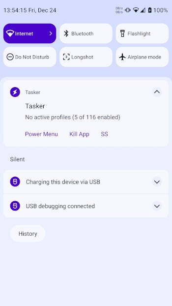
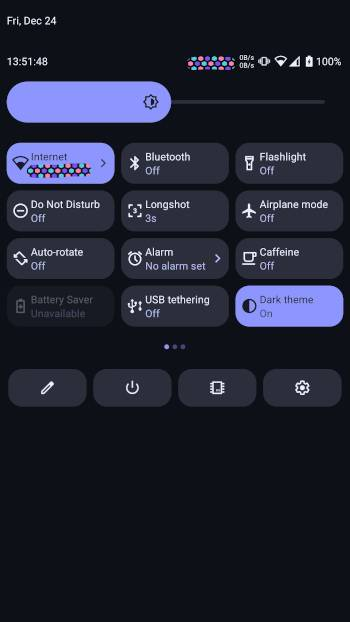
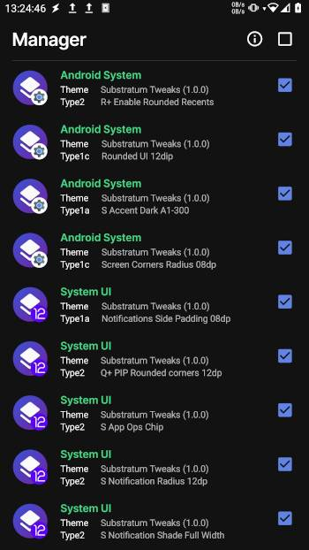

# Substratum Tweaks

</td>

A substratum theme to tweak Android's resource values on recent android versions.

By using this software accept the responsibility of any error that could be caused by the options
in this theme, the majority of them were tested using custom roms and are not warranted to work with OEM software.

<b>Please read [how to recover from a bootloop or system crash](#Recovering-from-boot-loop) before using this!!!</b>

# Installing
**F-Droid**:

<a href="https://apt.izzysoft.de/fdroid/index/apk/com.luisbocanegra.substweaks"></a>

**Manual**: Download and install the APK from the [Releases page](https://github.com/luisbocanegra/substratum-tweaks/releases).

## Requirements
* **Rooted** Android 9+ device
* A Theme manager (to install and enable the overlays from this app):
  * **substratum lite theme engine lite:** [Google Play Store](https://play.google.com/store/apps/details?id=projekt.substratum.lite)
# Features
### Android System
- Status Bar height
- Q+ UI & Screen rounded corners
- Q+ force rounded recents
- S+ Alternate accent color options from Material You generated colors
- more...
### System UI
- Q+ Notification panel side padings
- Status Bar icon limits
- R+ Blur radius
- R+ Power controls columns
- Q+ PIP rounded corners
- S+ Combined Status bar icons
- Q+ Notification panel radius
- Q+ QS panel rows & columns
- Wifi & Data activity indicators  
- more...

# Screenshots
 <table>
  <tr>
    <td> </td>
    <td> </td>
    <td> </td>
   </tr> 
  </tr>
</table>

# Recovering from boot loop
## ADB (Requires granted adb permission before)
### Linux (Desktop grep and cut tools):
1. Make sure that the device is detected: `adb devices`
2. List this app's enabled overlays: `adb shell cmd overlay list | grep -i substratumTweaks | grep -e '\[x\]'| cut -d ' ' -f2`
3. Disable the culprit overlay: `adb shell cmd overlay disable --user 0 com.android.systemui.SubstratumTweaks.EXAMPLE_OVERLAY`

    **OR** One-liner to disable all overlays from this app:

    ```sh
    overlays_adb=$(adb shell cmd overlay list | grep -E '\[x\].*SubstratumTweaks'| cut -d ' ' -f2) && for overlay in $overlays_adb; do adb shell cmd overlay disable --user 0 $overlay; done
    ```
4. If required: 
   - Restart the SystemUI (Root granted before): `adb shell su -c pkill -TERM -f com.android.systemui`
   - If required reboot the device either manualy or through adb: `adb reboot`

### Linux/Windows (Android's grep and cut tools):
1. Make sure that the device is detected: `adb devices`
2. List this app's overlays: `adb shell "cmd overlay list | grep -E '\[x\].*SubstratumTweaks' | cut -d ' ' -f2"`
3. Disable the culprit overlay: `adb shell cmd overlay disable --user 0 com.android.systemui.SubstratumTweaks.EXAMPLE_OVERLAY`

    **OR** Disable all overlays from this app:

    ```sh
    adb shell
    overlays_adb=$(cmd overlay list | grep -E '\[x\].*SubstratumTweaks'|cut -d ' ' -f2) && for overlay in $overlays_adb; do cmd overlay disable --user 0 $overlay; done
    ```
4. If required: 
   - Restart the SystemUI (Root granted before): `adb shell su -c pkill -TERM -f com.android.systemui`
   - If required reboot the device either manualy or through adb: `adb reboot`

## Custom Recovery
1. Reboot the device manualy or through adb: `adb reboot recovery`
2. In recovery mode delete the suspected overlay(s) inside the `/data/adb/modules/projekt.substratum.lite.helper/system/app` folder