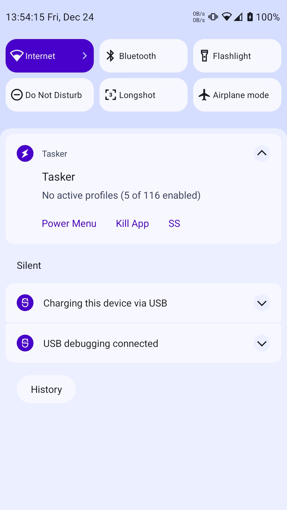
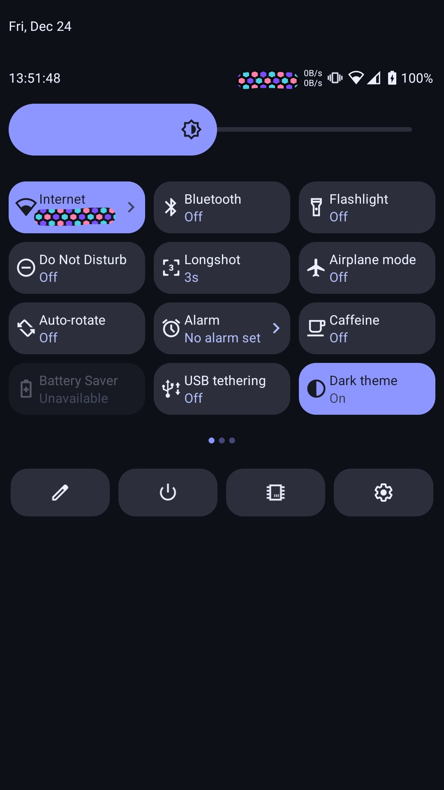
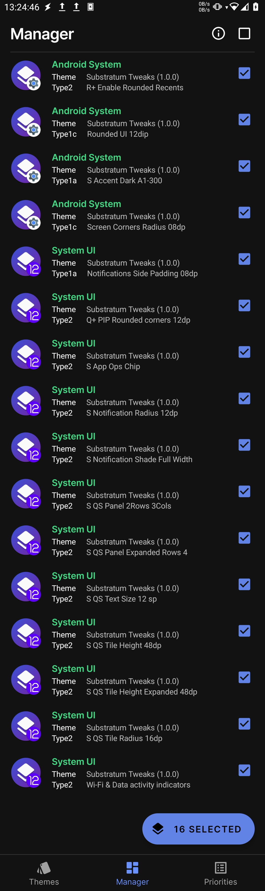

# Substratum Tweaks
A substratum theme to tweak Android's resource values on recent android versions.

By using this software accept the responsibility of any error that could be caused by the options
in this theme, the majority of them were tested using custom roms and are not warranted to work with OEM software.

**Make sure you know how to recover from a bootloop or system crash before using this.**
# Features
## Android System
- Status Bar height
- Q+ UI & Screen rounded corners
- Q+ force rounded recents
- S+ Alternate accent color options from Material You generated colors
- more...
## System UI
- Q+ Notification panel side padings
- Status Bar icon limits
- R+ Blur radius
- R+ Power controls columns
- Q+ PIP rounded corners
- S+ Combined Status bar icons
- Q+ Notification panel radius
- Q+ QS panel rows & columns
- Wifi & Data activity indicators  
- more...
# Changelog
## 24-12-2021
- Initial public release
# Screenshots
 <table>
  <tr>
    <td> </td>
    <td> </td>
    <td> </td>
   </tr> 
  </tr>
</table>